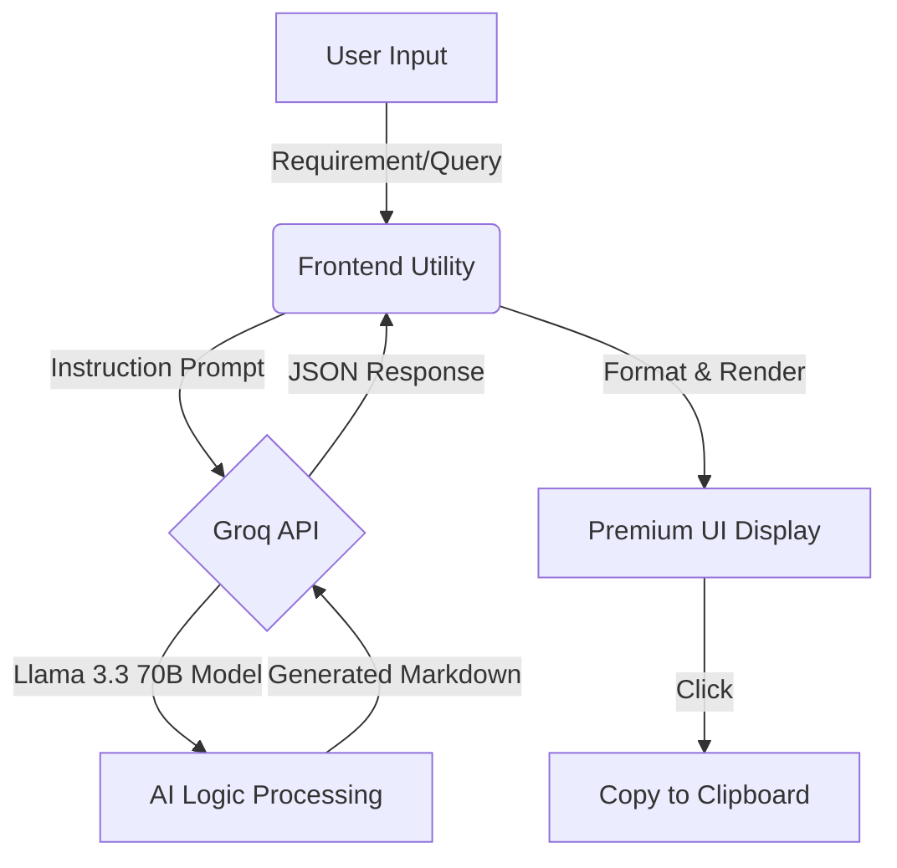

# AI Test Case Generator 🚀

A premium, AI-powered manual test case generator web application. This tool leverages the high-speed **Groq API** (Llama 3.3 70B) to transform simple user requirements into comprehensive, structured software test cases.

## 🎨 Preview
The application features a modern **Glassmorphic UI** with fluid animations and a responsive dark theme, designed for a premium user experience.

## 🛠️ Tech Stack
- **Core**: Vanilla JavaScript (ES6+), HTML5
- **Styling**: Modern CSS3 (Glassmorphism, Gradients, Flexbox/Grid)
- **AI Engine**: [Groq Cloud API](https://groq.com/) (Llama-3.3-70b-versatile)
- **Build Tool**: [Vite](https://vitejs.dev/)
- **Typography**: Outfit & Inter (Google Fonts)

## 📊 System Architecture



## ✨ Key Features
- **Instant Generation**: Get detailed test cases in seconds thanks to Groq's low-latency inference.
- **Smart Formatting**: Test cases include ID, Description, Pre-requisites, Steps, Expected Results, and Priority.
- **Modern UI**: Dark mode, subtle hover effects, and smooth transitions.
- **One-Click Copy**: Copy generated test cases directly to your clipboard for use in Jira, TestRail, or documentation.
- **Secure**: Uses environment variables for API key management.

## 🚀 Getting Started

### Prerequisites
- [Node.js](https://nodejs.org/) (v20.19+ or v22.12+)
- A Groq API Key

### Installation

1. **Clone the repository:**
   ```bash
   git clone https://github.com/MarufCode/TestCasegeneratorUsingGROQ.git
   cd TestCasegeneratorUsingGROQ
   ```

2. **Install dependencies:**
   ```bash
   npm install
   ```

3. **Configure Environment Variables:**
   Create a `.env` file in the root directory and add your Groq API key:
   ```env
   VITE_GROQ_API_KEY=your_groq_api_key_here
   ```

4. **Run the development server:**
   ```bash
   npm run dev
   ```
   The app will be available at `http://localhost:5173/`.

### Building for Production
```bash
npm run build
```

## 📝 Usage
1. Enter your feature description or user story in the text area.
2. Click **"Generate Test Case"**.
3. Review the high-quality test cases generated by the AI.
4. Use the **"Copy to Clipboard"** button to export them.

---
Built with ❤️ for Quality Assurance Engineers.
